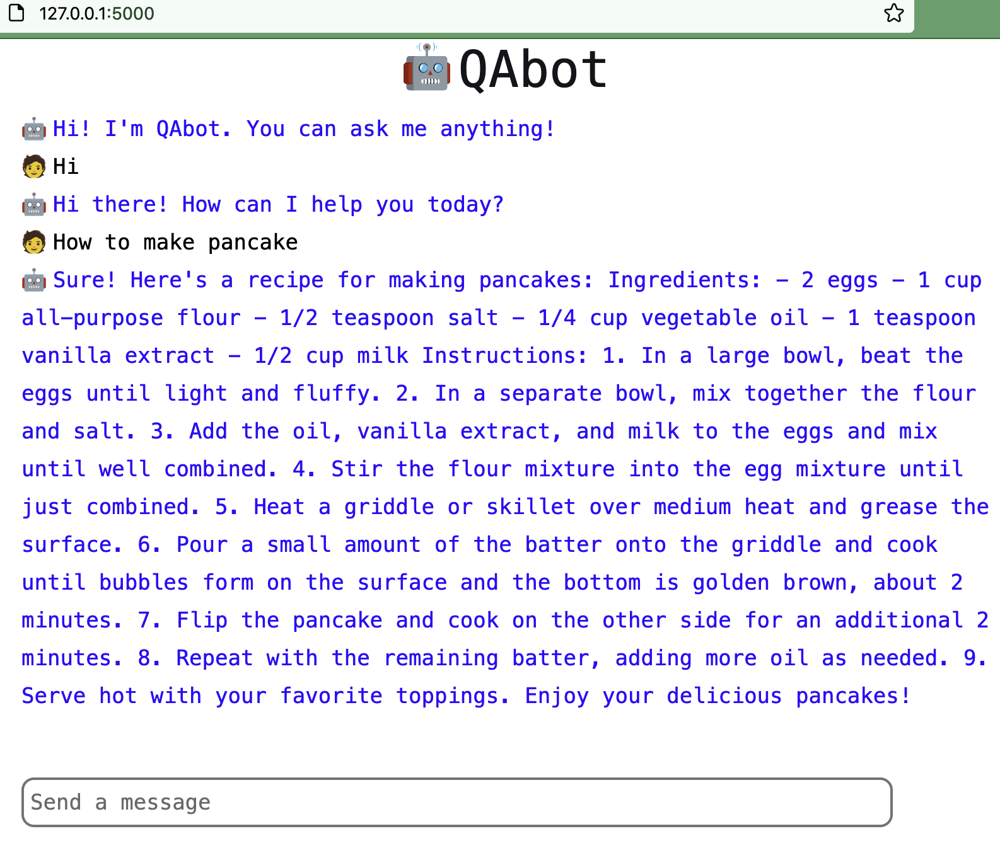

# QAbot
Question answering bot web application

# Environment
MacOS
Please open Terminal on MacOS for the following steps.

# Installation before running
```
pip install Flask
```
```
pip install farm-haystack[inference]
```

# Run on local devices (default port: 5000)
```
git clone https://github.com/runballoon/QAbot.git
```
```
cd QAbot
```
```
python main.py
```
After the model is successfully loaded, there will be prompt "Running on http://127.0.0.1:5000/ (Press CTRL+C to quit)".
Please open a browser and go to http://127.0.0.1:5000/.

Successfully run program should look like this:


## To run on another port
In the current directory(QAbot/):
```
export FLASK_APP=main
```
```
flask run -p [available port]
```

# Issues
When get prompts like "I'm sorry, but I don't understand what you mean. Can you please rephrase your question?", it's likely that the model is not run correctly. Please exit the current server and run the program again.
